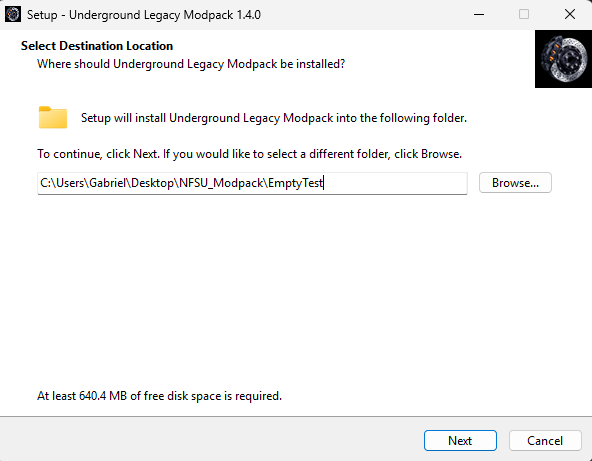
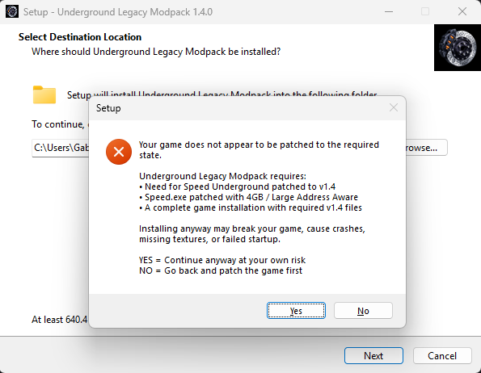
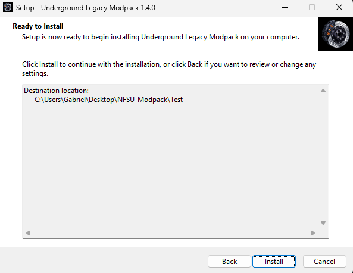
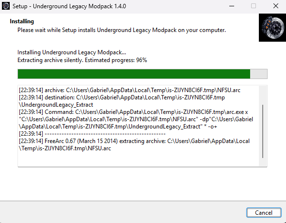
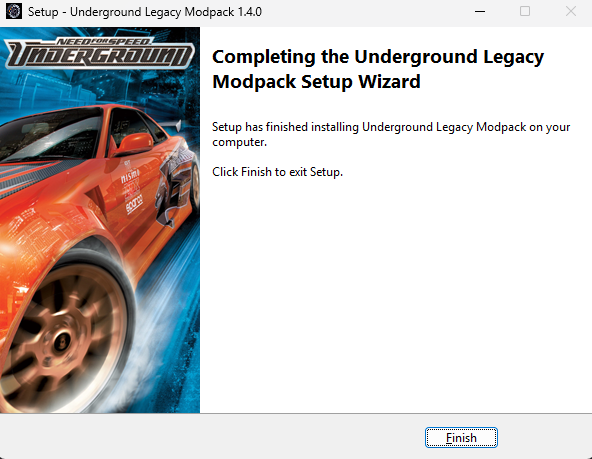
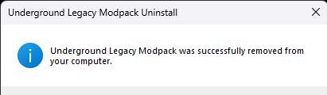
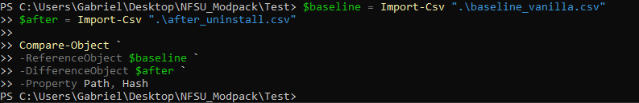
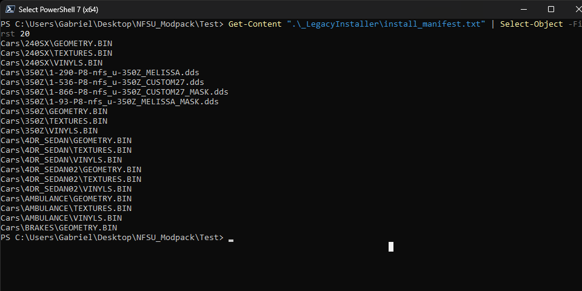
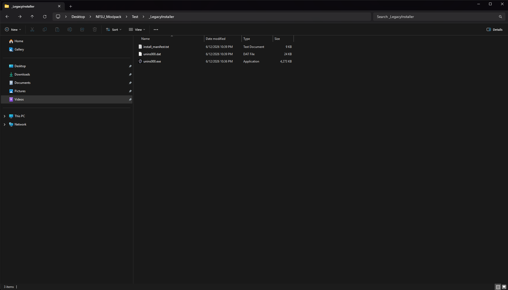
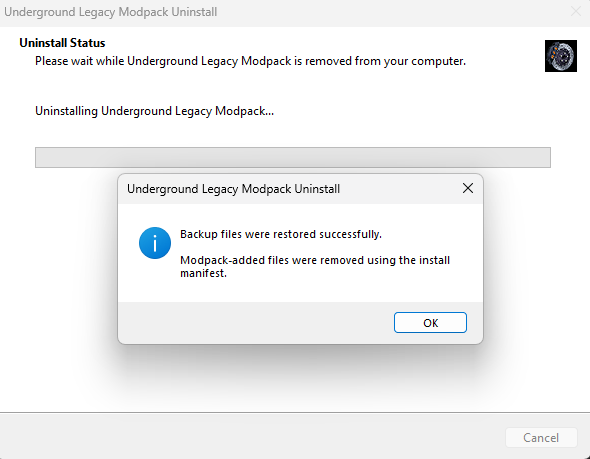

# NFS Legacy Modpacks

Modern installer framework and restoration-focused modpacks for classic **Need for Speed** titles.

This repository provides standardized **Inno Setup installer architecture**, rollback validation workflows, and restoration-safe installation systems for legacy Need for Speed modpacks.

The goal of this project is to modernize installation for legacy Need for Speed games while preserving **reliability, reversibility, and deterministic rollback**.

---

## Supported Titles

* Need for Speed Underground
* Need for Speed Underground 2
* Need for Speed Most Wanted
* Need for Speed Carbon
* Need for Speed ProStreet
* Need for Speed Undercover

---

## Features

### Installer Features

* FreeArc-based archive extraction
* Splash screen support
* Automatic game folder detection
* Game installation validation
* Large Address Aware (4GB Patch) executable verification
* Manifest-based installed file tracking
* Backup restoration during uninstall
* Clean rollback system using `_LegacyInstaller`
* SHA256 rollback verification workflow

### Validation Features

* File hash comparison before installation
* File hash comparison after uninstall
* Rollback integrity verification
* Deterministic uninstall validation
* Manifest-based file cleanup
* Vanilla restoration confirmation

---

## Screenshots

The installer framework includes rollback-safe workflows designed to restore the original game state after uninstall.

### Underground Installer

Installer startup and welcome screen.



### Installation Validation Warning

Example warning shown when the game installation does not meet required validation requirements.



### Installation Ready State

Installer configured and ready to begin installation.



### Installation Progress

Archive extraction and installation progress with logging enabled.



### Installation Complete

Successful installation state.



### Uninstall Completion

Successful uninstall and restoration state.



### Rollback Validation

Successful rollback verification after uninstall.

A clean comparison result (**no output**) confirms that the post-uninstall game state matches the original vanilla baseline.



### Manifest Tracking

Example of generated installation manifest tracking modpack-installed files for safe removal during uninstall.



### Legacy Installer Structure

Generated uninstall infrastructure used for rollback and restoration.



### Rollback Confirmation

Example of rollback confirmation during uninstall.



---

## Rollback System

Each installer tracks installed files using:

```txt
_LegacyInstaller/install_manifest.txt
```

During uninstall, the installer:

1. Deletes files listed in the install manifest
2. Restores original files from the `Backup` folder
3. Removes empty leftover directories
4. Returns the game folder to its original pre-install state

Rollback validation documentation is available in:

```txt
docs/rollback-validation.md
docs/hashing-commands.md
```

A successful rollback validation produces:

```powershell
Compare-Object `
-ReferenceObject $baseline `
-DifferenceObject $after `
-Property Path, Hash
```

With **no output**, confirming a clean uninstall and exact restoration.

---

## Repository Structure

```txt
NFS-Legacy-Modpacks/
├── docs/
├── releases/
├── screenshots/
│   ├── installers/
│   └── rollback/
├── source/
│   ├── ArcRunner/
│   ├── Inno/
│   └── Splash/
├── templates/
├── .gitignore
├── CHANGELOG.md
├── LICENSE
└── README.md
```

### Folder Overview

| Folder         | Purpose                                                |
| -------------- | ------------------------------------------------------ |
| `docs/`        | Validation, hashing, rollback, and build documentation |
| `source/`      | Inno Setup scripts and source components               |
| `templates/`   | Shared reusable installer templates                    |
| `screenshots/` | Installer and rollback validation screenshots          |
| `releases/`    | Release placeholders and packaged builds               |

---

## Installer Philosophy

Every installer in this project is designed to:

* Validate game installation state
* Detect unsupported or improperly patched copies
* Install safely
* Support deterministic rollback
* Restore the original game cleanly

The uninstall process is treated as equally important as installation.

---

## Important Notice

This repository **does not include**:

* Commercial game files
* EA copyrighted assets
* Modpack archive payloads
* Redistributed game executables

You must legally own the original games and provide your own game installation.

---

## Roadmap

* [x] Underground installer architecture
* [x] Underground 2 installer architecture
* [x] Most Wanted installer architecture
* [x] Carbon installer architecture
* [x] ProStreet installer architecture
* [x] Undercover installer architecture
* [x] Rollback validation framework
* [x] Screenshot documentation
* [ ] Shared reusable installer template
* [ ] Public release packaging
* [ ] Documentation expansion
* [ ] Multi-title screenshot gallery

---

## License

Licensed under the **MIT License**.
